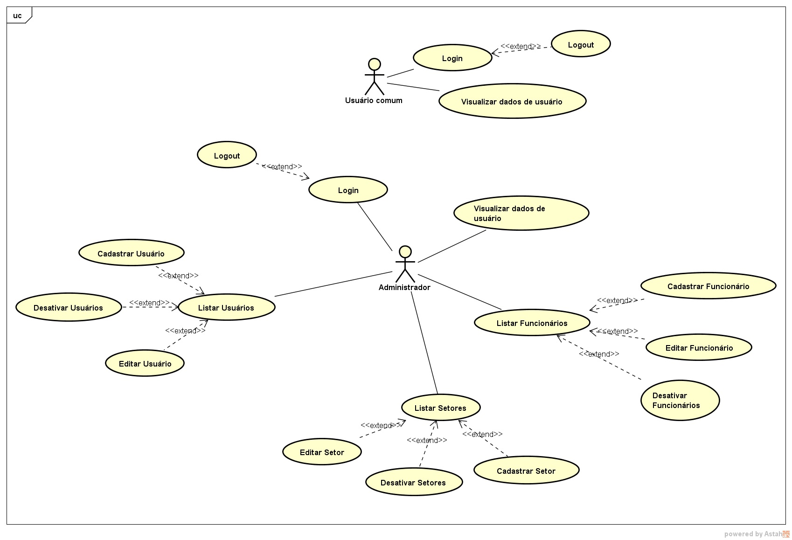

# [1.](#header-1) [Objetivo](https://github.com/jucimarjr/zelda/edit/master/docs/index.md)

Desenvolver um Sistema de autenticação, denominado Zelda, o qual é um protótipo para o Sistema SAMUS. Com a finalidade de levantar os principais pontos relacionados ao desenvolvimento do projeto real, no que tange tecnologias e documentações relacionadas. Para que a experiência de desenvolvimento seja a mais branda possível, de forma a não ocorrer atrasos inesperados por ausência de conhecimento de determinada tecnologia, ou até mesmo, necessidade de conhecimento de funcionamento de processos.
>Para acessar o código do projeto, [clique aqui](https://github.com/jucimarjr/zelda)

# [2.](#header-1) Requisitos
  Os requisitos de um sistema são descrições dos serviços fornecidos pelo sistema e as suas restrições operacionais. Esses requisitos refletem as necessidades dos clientes de um sistema que ajuda a resolver algum problema, por exemplo, controlar um dispositivo, enviar um pedido ou encontrar informações (SOMMERVILLE,2011).

## [2.1.](#header-2) Não Funcionais
  São restrições aos serviços ou funções oferecidos pelo sistema. Incluem restrições de timing, restrições no processo de desenvolvimento e restrições im postas pelas normas (SOMMERVILLE,2011).

 |     Codigo         | Nome                    | Descrição     |
 |:-------------------|:------------------------|:--------------|
 |RNF001              |Uso do Flask/Bootstrap   |Para o desenvolvimento deste projeto deve ser utilizado entre outras feramentas Flask e Bootstrap      |
 |RNF002              |Uso do GitHub            |Todo o codigo fonte deve ser versionado por meio do GitHub |
 |RNF003              |Codigo fonte padronizado |Todo o codigo fonte deve seguir o padrão previamente estabeecido    |
 |RNF004              |Uso do Trello            |Todas as tarefas do projeto devem ser organizadas por meio do Trello		|
 |RNF005              |Segurança		            |O sistema deve garantir que seus dados não sejam acessados por pessoas sem as devidas permissões      |
 |RNF006		          |URLs amigáveis	          |O sistema deve possuir URLs de de fácil leitura e intuitivas	|
 |RNF007		          |Usuario Administrador   |Apenas o usuario administrador pode acessar os funcionarios e os seus setores |
 |RNF008		          |Telas separadas para funcionario e lotação| <space><space> |

* * *
## [2.2](#header-3) Funcionais
Os requisitos funcionais são declarações que o sistema deve fornecer, de como o sistema deve reagir a entradas específicas e de como o sistema deve se comportar em determinadas situações (SOMMERVILLE,2011).

## [2.2.1.](#header-4) Usuário
São os requisitos funcionais com os quais o usuário interage diretamente, de tal forma que sua participação ativa é necessária para que alguma ação seja efetuada pelo sistema.

|     Codigo         | Nome                    | Descrição     |
|:-------------------|:------------------------|:--------------|
| RF001              | Login unico             |O sistema deve permitir ao usuario que  entre no sistema por meio do seu login unico e senha       |
| RF002               | Cadastrar funcionarios  |O sistema deve permitir ao usuario cadastrar novos funcionarios   |
| RF003               | Cadastrar setor	       |O sistema deve permitir ao usuario cadastrar novos setores  |
| RF004               | Relacionar funcionario a setor                   |O sistema deve permitir ao usuario relacionar um funcionario a um setor    |
| RF005               | Cadastro de usuarios    |O sistema deve permitir ao usuario que se cadastre no sistema por meio de um login e senha |

* * *

## [2.2.2.](#header-4) Sistema
São os requisitos funcionais com os quais o usuário não interage diretamente, de modo que sua participação ativa não é necessária para que o sistema efetue alguma ação.

* * *

## [2.3. ](#header-2) Regras de Negócio

> Devido ao alto detalhamento das informações das regras de negócio, esta encontra-se nesta documentação somente em sua forma resumida. Para acessar o conteúdo completo, [clique aqui](negocio.md).

- Usuário
  - O usuário poderá fazer login;
    - Enquanto o usuário estiver logado, poderá fazer logout;
  - O usuário poderá visualizar seus dados;
- Administrador
  - O administrador poderá fazer login;
    - Enquanto o administrador estiver logado, poderá fazer logout.
  - O administrador poderá visualizar seus dados;
  - O administrador poderá listar usuários;
    - Nesta lista, o administrador poderá cadastrar, editar e desativar um ou mais usuários.
  - O administrador poderá listar funcionários;
    - Nesta lista, o administrador poderá cadastrar, editar e desativar um ou mais funcionários.
  - O administrador poderá listar setores;
    - Nesta lista, o administrador poderá cadastrar, editar e desativar um ou mais setores.

* * *

## [2.4. ](#header-2) Diagrama de Casos de Uso

> Devido ao alto detalhamento das informações dos casos de uso, esta encontra-se nesta documentação somente em sua forma resumida. Para o conteúdo completo, [clique aqui](https://docs.google.com/a/uea.edu.br/document/d/1YnygnlwL0KUH9y1mdlf3ZreXEkavQIohUOKKkdrtPz4/edit?usp=sharing)

### [2.4.1 ](#header-2) Atores do Sistema

- **Administrador**:  Usuário do sistema que possui acesso às funcionalidades de CRUD do sistema, incluindo o CRUD para as tabelas de Usuário, Funcionário e Setores.

- **Usuário comum**: Usuário do sistema que, por enquanto, só pode visualizar seus dados de usuário após ser autenticado pelo sistema.

### [2.4.2 ](#header-2) Casos de Uso

- Cadastrar Setor
- Cadastrar Funcionário
- Cadastrar Usuário
- Editar Usuário
- Editar Setor
- Editar Funcionário
- Listar Funcionários
- Listar Setores
- Listar Usuários
- Desativar Usuário
- Desativar Setor
- Desativar Funcionário
- Login
- Logout
- Visualizar Dados de Usuário

* * *

## [3.](#header-2) Análise e Projeto

O projeto segue esquematizado na forma de Entidade e Relacionamento, onde as principais entidades (setor, funcionário, usuário) são postas em tabelas no modelo físico do Banco de Dados. Onde cada tabela tem seus atributos específicos em cada coluna deixando assim populado todas as informções do sistema referente as entidades envolvidas do sistema.

## [3.1](#header-2) Tabelas

### [3.1.1](#header-2) [Tabela de Setor](setor.md)

### [3.1.2](#header-2) [Tabela de Usuário](usuario.md)

### [3.1.3](#header-2) [Tabela de Funcionário](funcionario.md)

* * *

## [4. ](#header-2)Implementação

Na sua versão atual, o sistema contém 6(seis) telas, que compõem o módulo Zelda. Onde estas são:

- [Login](https://docs.google.com/a/uea.edu.br/document/d/1L7sYBf0ZaKGEKfPf_h7y5uq32a7BxG4NOdgCQpNOZrY/edit?usp=sharing)
- [Administrador](https://drive.google.com/a/uea.edu.br/file/d/0B09Ckx-J88eyUE5feHprT1htUm8/view?usp=sharing)
- [Usuário](https://drive.google.com/a/uea.edu.br/file/d/0B09Ckx-J88eyQ2pfVXFoMWhra2M/view?usp=sharing)
- [Cadastro de funcionários](https://drive.google.com/a/uea.edu.br/file/d/0B09Ckx-J88eybXJaMU1zR1NiREk/view?usp=sharing)
- [Cadastro de setor](https://drive.google.com/a/uea.edu.br/file/d/0B09Ckx-J88eyQUd2djdIaE1ZVU0/view?usp=sharing)
- [Cadastro de usuário](https://drive.google.com/a/uea.edu.br/file/d/0B09Ckx-J88eyMGVoTkd6UGdZZms/view?usp=sharing)
- [Listagem de funcionários](https://drive.google.com/a/uea.edu.br/file/d/0B09Ckx-J88eya2J0enU5d09iaUk/view?usp=sharing)
- [Listagem de setores](https://drive.google.com/a/uea.edu.br/file/d/0B09Ckx-J88eya2J0enU5d09iaUk/view?usp=sharing)
- [Listagem de usuários](https://drive.google.com/a/uea.edu.br/file/d/0B09Ckx-J88eydTRDV0V2WkhZaHM/view?usp=sharing)

Segue abaixo a iteração entre as telas do sistema.

* * *

## [5. ](#header-2)Planejamento e Gerência

<<<<<<< HEAD
### [5.1. ](#header-3)Interação
- [Interação 0.0.4](interacao.md)
=======
### [5.1. ](#header-3)Iteração
- [Iteração 4](interacao.md)
>>>>>>> 4df93e858020f6f168f70b1b7ee95a20c637dcd7

* * *

